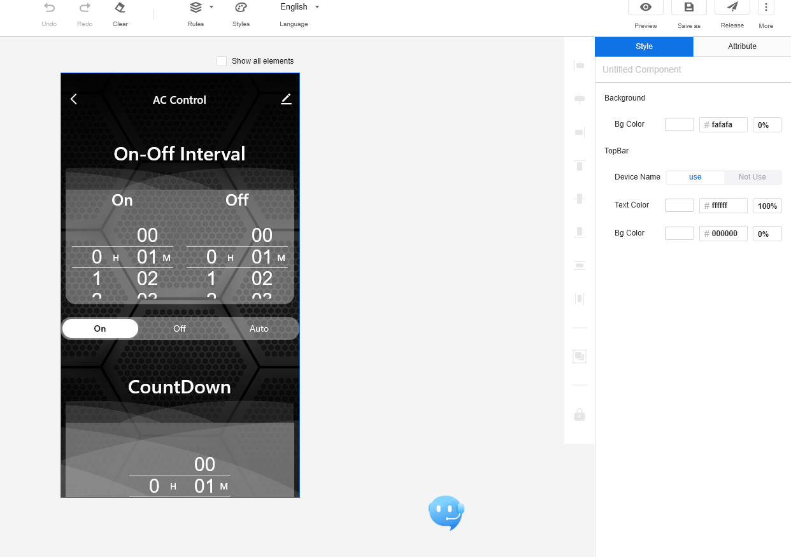

# AC-Controller - Amir Gorkovchenko (July 2023)

This project was for a friend. It was created as a small project to fix a very specific issue with an AC Unit.

The AC Unit had issues with running too long and overheating.
This program utilized a relay and timers to turn periodically turn the AC unit off and on to prevent overheating

Everything was carfully packaged into a small 3D printed case with a solid state relay and an Atmega328p processor coupled with an esp8266.
The esp8266 acted as the bridge to an iot service called TUYA Smart.

All parameters for the AC controller can be easily changed through this app. This device was designed for reliability and long uptimes

### Note
All developed core libraries required to compile this project will be found in the Core branch
 
## App Dev Photo
On-Off intervals are set using the On-Off Interval sliders.\
The CountDown timer shows the remaining time before the next Interval

